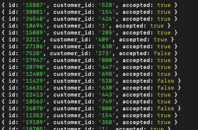

# Velocity Limits

Program that accepts or declines attempts to load funds into customers' accounts. To see the complete requirements, read the [INSTRUCTIONS](INSTRUCTIONS.md).

## :gear: Dependencies

- [node](https://nodejs.org/en/)
- [yarn](https://yarnpkg.com/)

## :rocket: Getting start

Install dependencies:

```sh
yarn install
```

Run the project:

```sh
yarn start
```

The result will be written in the `output.txt` file located in the project's root folder and printed on your terminal:



## :vertical_traffic_light: Testing

### Linter with ESLint

```bash
yarn lint
```

### Unit test with Jest

```bash
yarn test
```
